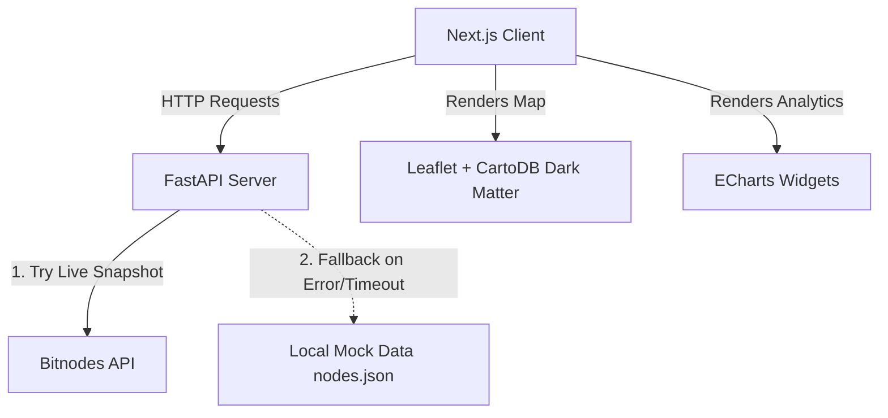

# Real Rails: Bitcoin Node Geography Dashboard

An interactive, high-fidelity real-time intelligence dashboard to visualize the global distribution of Bitcoin nodes, assess infrastructure resilience, and analyze cloud hosting provider concentration. 

Built as part of the **Real Rails Intelligence Library** (PoC ID #87: Settlement & Infrastructure).

---

## 🏗️ System Architecture

The project consists of a decoupled Python FastAPI backend and a Next.js (React/TypeScript) frontend:



### Key Technical Choices
*   **Visual Identity**: Built around the `#030712` Obsidian Black visual system with Sleek Glassmorphism and Electric Cyan / Indigo active accents.
*   **Aesthetics**: 70/30 layout split (70% Map stage / 30% Intelligence Sidebar).
*   **Data Orchestration**: Python FastAPI backend parsing the latest Bitnodes network snapshots, cleaning and aggregating metrics via Pandas.
*   **Visualizations**: Custom React-Leaflet configuration using dark CartoDB tile layers and custom glowing SVG marker animations. Dynamic leaderboards and trend lines implemented using ECharts.
*   **Resilience (2-Hour Rule)**: Includes an automatic fallback to high-fidelity local `nodes.json` mock data if the public Bitnodes API is down, rate-limited, or unreachable.

---

## 🚀 Getting Started

### Prerequisites
*   Python 3.10+
*   Node.js 18+ (npm)

### Setup & Run (Step-by-Step)

#### 1. Backend Server Setup
Open a terminal, navigate to the `backend` directory, activate the virtual environment, and start the FastAPI server:
```bash
# Navigate to backend
cd backend

# Activate Virtual Environment (Windows PowerShell)
.\venv\Scripts\activate

# Or on macOS/Linux:
# source venv/bin/activate

# Install dependencies
pip install -r requirements.txt

# Start development server on port 8080 (to avoid WSL relays)
python -m uvicorn app.main:app --port 8080 --reload
```
The backend API documentation will be available at [http://localhost:8080/docs](http://localhost:8080/docs).

#### 2. Frontend Dashboard Setup
Open a second terminal, navigate to the `frontend` directory, install dependencies, and start the Next.js development server:
```bash
# Navigate to frontend
cd frontend

# Install package dependencies
npm install

# Start Next.js dev server
npm run dev
```
Open your browser and navigate to **[http://localhost:3000](http://localhost:3000)** to view the dashboard.

---

## 🔌 API Endpoints Reference

The FastAPI backend exposes the following REST endpoints:

*   `GET /`: Base health status.
*   `GET /api/nodes/summary`: Returns core network KPIs (total reachable nodes, 24h count change, average consensus block height, top country, and ASN percentages).
*   `GET /api/nodes/map`: Returns coordinate coordinates and metadata (e.g. User Agent, ASN, block height) for active nodes. Supports optional filter parameters `?country=...` and `?asn=...`.
*   `GET /api/nodes/stats`: Returns aggregated data for ECharts graphics (top country shares, top ASN hosting providers, client versions, and 30-day historical trend).
*   `GET /api/nodes/download`: Stream-generates a downloadable CSV containing the entire active node list, formatted for direct GIS ingestion.

---

## 🖥️ VS Code Git & GitHub Publishing Guide

To push this project to a new repository on your GitHub account from VS Code:

1. Open a new terminal in the **root folder** of the project (`bitcoin-node-dashboard`).
2. Run the following Git commands:

```bash
# Initialize local git repository
git init

# Add all project files
git add .

# Create the initial commit
git commit -m "feat: implement high-fidelity bitcoin node geography dashboard"

# Rename default branch to main
git branch -M main

# Link to your personal GitHub repository (replace with your actual GitHub repository URL)
git remote add origin https://github.com/YOUR_GITHUB_USERNAME/bitcoin-node-geography.git

# Push the code to GitHub
git push -u origin main
```
*(If you are not logged in to GitHub on VS Code, it will automatically open a browser window to securely authorize your git client.)*
